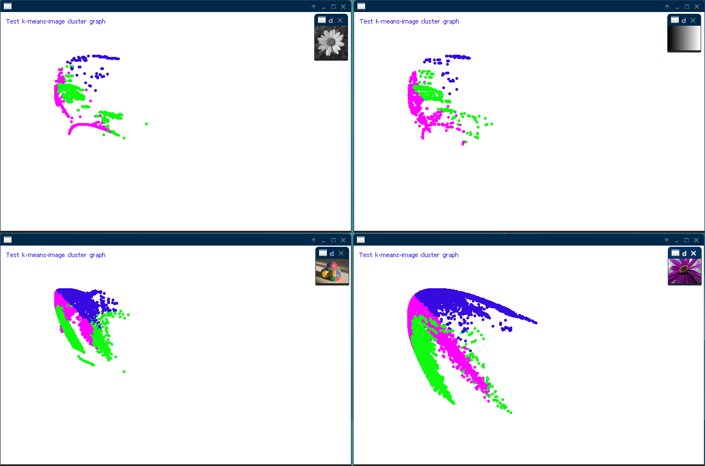
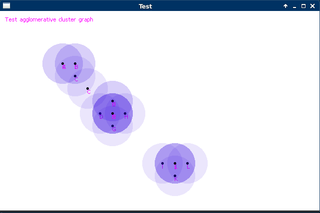
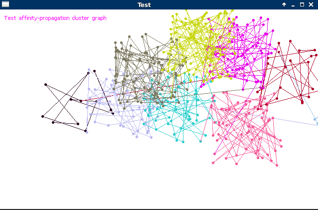
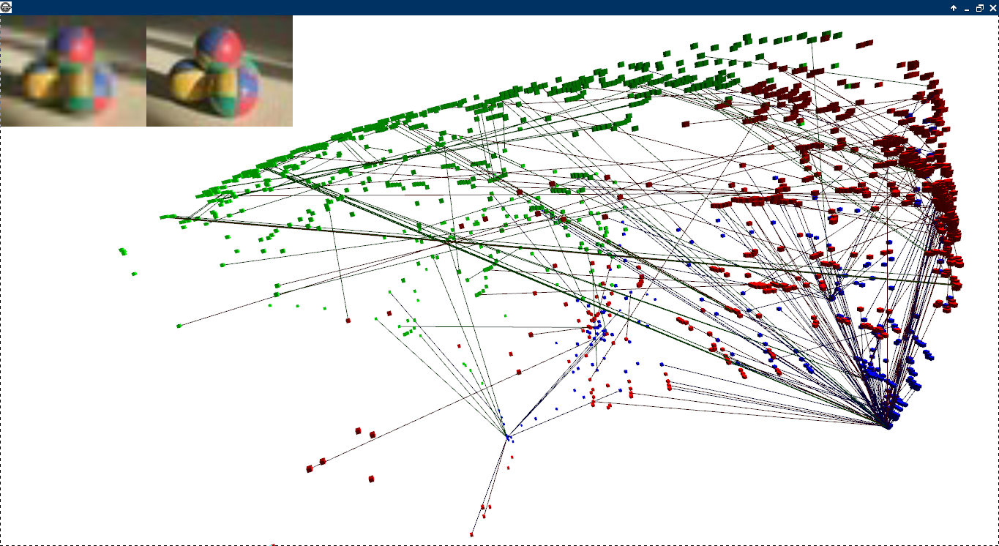
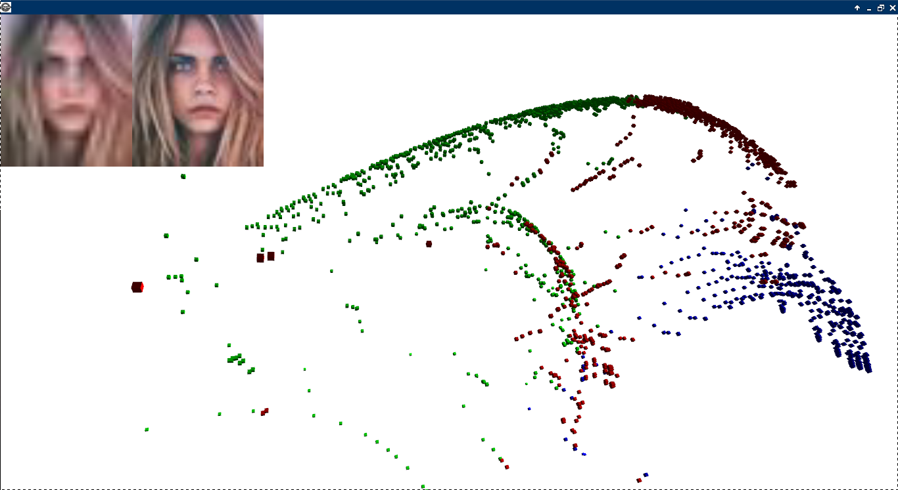

# Clustering graph

<b style="background:red;">(Under Construction)</b> 
Test, implementation of various algorithm of cluster graph.  

<ul>
<li>K-Means</li>
<li>Affinity propagation</li>
<li>Agglomerative hierarchical</li>
</ul>
 
<b>Test K-Means image</b> 
 
<b>Test agglomerative 2D</b> 
 
<b>Test affinity 2D</b> 
 
 
<b>Test recostruction (under costruction)</b>
 
 
 
