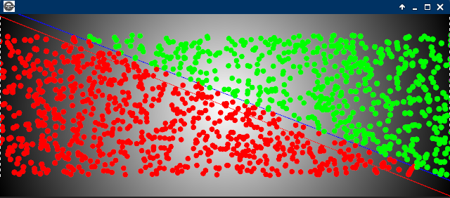
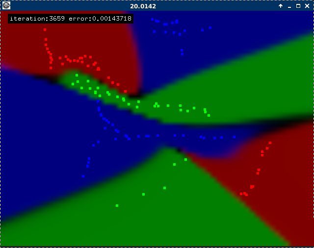

<b>(Under Construction)</b> 
Study, implementation of various algorithm: multi-layer-perceptron, cluster graph, cnn, rnn  

# Perceptron
<ul>
<li>Perceptron</li>
<li>Multilayer-perceptron</li>
</ul>
<b>single neuron perceptron</b> 
https://en.wikipedia.org/wiki/Perceptron
 
<b>Multilayer perceptron</b> 
https://en.wikipedia.org/wiki/Multilayer_perceptron
 

# Clustering graph
<ul>
<li>K-Means</li>
<li>Affinity propagation</li>
<li>Agglomerative hierarchical</li>
</ul>
 
<b>Test K-Means image</b> 
https://en.wikipedia.org/wiki/K-means_clustering
 
<b>Test agglomerative 2D</b> 
https://en.wikipedia.org/wiki/Hierarchical_clustering
 
<b>Test affinity 2D</b> 
https://en.wikipedia.org/wiki/Affinity_propagation
 
 
<!--<b>Test recostruction (under costruction)</b>

 -->
